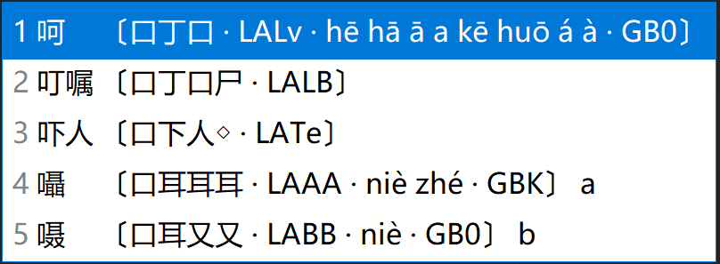
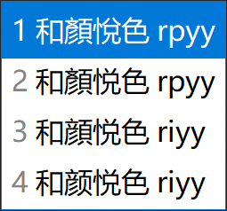

<!-- omit in toc -->
# 各平臺下載和安裝
{: .no_toc }

  

    目錄
  

  {: .text-delta }
1. TOC
{:toc}

## QQ 群資源

官方 QQ 群中提供本輸入法的全部資源，還有同好一起討論相關問題。點擊加入官方QQ群: [735728797](https://jq.qq.com/?_wv=1027&k=2OYDP4Tk)

## RIME 平臺安裝（小狼毫、鼠須管、同文、iRime、倉輸入法）

{: .important}
> iOS 平臺上的免費應用「倉輸入法」内置宇浩，歡迎下載。

下面介紹的是掛載於[RIME平臺（小狼毫、鼠須管、同文、iRime）](https://rime.im/)的方案。我對它進行了深度定製，具有以下特點：

- 提供至 CJK-I 區、兼容區、部首區超過99000個漢字的完整拆分、編碼提示、字集提示。
- 支持自定義字符集過濾生僻字。常用字約一萬字，包括GB2312漢字、國語常用字、其它常用漢字等。支持用户自定義修改。
- 提供四碼只出單字功能，適合單字派。
- 提供生僻字後置、生僻字屏蔽功能。

在安裝了 Rime（小狼毫、鼠須管、同文、iRime）後，[在這個頁面下載最新版本](https://github.com/forFudan/yuhao/releases)。 文件夾下的**所有文件**複製到**用户文件夾**下（可以右擊 Rime 圖標後點擊「用户文件夾」來打開）。點擊「部署」之後卽可使用。

方案文件介紹：

- yuhao.schema.yaml 簡化漢字優先方案，名爲「開來學」。
- yuhao_tradition.schema.yaml 傳統漢字大陸字形優先方案，名爲「繼往聖」。
- yuhao_tradition_tw.schema.yaml 傳統漢字臺灣字形優先方案，名爲「書同文」。
- yuhao.dict.yaml 簡化字優先主碼表。
- yuhao_tradition.dict.yaml 傳統漢字優先主碼表。
- yuhao.quick.dict.yaml 簡化字簡碼碼表。
- yuhao_tradition.quick.dict.yaml 傳統漢字簡碼碼表。
- yuhao_tradition_tw.quick.dict.yaml 傳統漢字臺灣字形簡碼碼表。
- yuhao.full.dict.yaml 單字全碼碼表。
- yuhao.words 宇浩核心簡體詞庫。約50000個詞語，頻率較高。
- yuhao.words_extended 宇浩增廣簡體詞庫。約30000個詞語，頻率較低，除非有特殊需求，否則不建議開啓。
- yuhao.words_literature 宇浩成語詩詞簡體詞庫。約15000個成語和詩詞，除非有特殊需求，否則不建議開啓。
- yuhao_tradition.words 宇浩核心繁體詞庫，包括臺灣、香港、大陸古籍繁體三種字形。約50000個詞語，頻率較高。
- yuhao_tradition.words_extended 宇浩增廣繁體詞庫。約30000個詞語，頻率較低，除非有特殊需求，否則不建議開啓。
- yuhao_tradition.words_literature 宇浩成語詩詞繁體詞庫。約15000個成語和詩詞，除非有特殊需求，否則不建議開啓。
- yuhao.symbols.dict.yaml 特殊符號碼表。
- yuhao_pinyin.schema.yaml 拼音配置文件，用於反查。
- yuhao_pinyin.dict.yaml 拼音字典文件。
- rime.lua 腳本設定。
- lua/yuhaoim/... 各種腳本。
- opencc/... 拆分表。

## RIME 平臺特色功能介紹

<!-- omit in toc -->
### 提示快捷鍵
{: .no_toc }

輸入`help`或`zzzz`或`bang`可顯示快捷鍵提示。

<!-- omit in toc -->
### 單字拆分三重註解
{: .no_toc }

提供至 CJK-I 區、兼容區、部首區超過99000個漢字的拆分、編碼提示、字集提示。拆分提示中包括三重註解：

1. 該漢字的拆分。
2. 該漢字的全碼。使用大小寫字母區分字根的姓名。
3. 該漢字所在的字符集（CJK，CJK-A 到 CJK-I 區，兼容字等）。

用户還可通過「Shift+Ctrl+C」切換拆分狀態。

<!-- omit in toc -->
### 增廣常用字符集
{: .no_toc }

本方案使用了自定的常用字符，將常用字一網打盡，避免了 RIME 内置字符集「GB2312字太少，GBK字太多」的問題。包括了以下一萬個左右的字符：

- 《通用規範漢字表》中定義的，在 GB2312 字集内的漢字
- 臺灣的「國字常用字」
- 286個大陸繁體字形
- 注音符號
- 「〇」符號

<!-- omit in toc -->
### 一鍵切換字符集
{: .no_toc }

在輸入過程中，用户可選擇兩種切換字集的方式：

- 通過「Shift+Ctrl+O」在常用字符集和CJK大字符集之間進行切換（過濾）。
- 通過「Shift+Ctrl+I」將常用字符集優先顯示（優先）。

用户還可通過「Shift+Ctrl+F」進行簡入繁出輸入。

<!-- omit in toc -->
### 使用 Z 鍵引導拼音反查
{: .no_toc }

按下 Z 鍵，可以隨時使用拼音輸入詞語，並實現反查。

反查字典中，繁簡體同權重，繁體字形包括大陸古籍、臺灣繁體、香港繁體、OpenCC繁體四套字形標準。

<!-- omit in toc -->
### 使用 z 鍵作爲通配符/學習符
{: .no_toc }

除第一碼外，可以使用z鍵代替其他編碼，方便一下子忘記字根姓名的你繼續輸入。

<!-- omit in toc -->
### 使用 z 鍵上屏歷史輸入
{: .no_toc }

可以使用`z`鍵快速上屏最近的歷史輸入。

<!-- omit in toc -->
### 輸入特殊符號
{: .no_toc }

本方案可以用編碼輸入特殊符號，包括標點符號、注音符號、日語假名（訓令羅馬字）等。只要輸入引導符號：

- `fh`引導注音符號。例如：ㄤ，`fhan`
- `jm`引導日語假名。例如：あ，`jma`
- `py`引導拼音字母。例如：ǎ，`pya`
- `bd`引導中文標點。例如：分號，`bdfh`
- `dy`引導德語字母。例如：ß，`dyss`
- `yj`引導易經六十四卦符號。例如：䷾（旣濟），`yjkl`。
- `kk`引導其他符號。

<!-- omit in toc -->
### 精確造詞
{: .no_toc }

輸入過程中，按下 ` 符號作爲分隔，使用**數字鍵或空格鍵**依次選擇單字，卽可實現精確造詞。

<!-- omit in toc -->
### 全碼詞語屏蔽
{: .no_toc }

一鍵屏蔽四碼詞語，同時保留簡碼詞。熱鍵爲「Shift+Ctrl+D」。適合保留簡碼詞的單字簡詞派。

## 碼表直接掛載

本方案的碼表可以在任何手機或電腦的輸入法 App 上掛載並使用，比如百度、搜狗、落格、小小等。由於本方案只使用25鍵，故而可以完美掛載在任何五筆字型輸入法的平臺上，並使用`Z`鍵的功能。

[點擊此處下載最新版本的各平臺碼表](https://github.com/forFudan/yuhaoim/releases)。

碼表因其格式，可以通用於多種平臺。以下爲幾種主要格式的介紹：

- 宇碼  空格  字符，UTF-8。此爲百度格式，適用於百度輸入法、搜狗輸入法、清歌輸入法。加上表頭後，也適用於小小輸入法、微軟輸入法、Fcitx輸入法。
- 字符  Tab  宇碼，UTF-8。此爲落格格式，適用於羅格輸入法、小胖輸入法。加上表頭後，也適用於RIME輸入法。
- 宇碼  Tab  字符，UTF-8。此爲大竹格式，適用於大竹詞提生成。

### 百度/搜狗手機輸入法

百度手機輸入法掛載碼表方法如下：

- 將 baidu 文件夾下的**yuhao.txt**下載到設備上
- 進入百度輸入法 iOS 版
- 點擊「我的」
- 點擊右上方設置按鈕
- 點擊「輸入設置」
- 點擊「五筆輸入」
- 點擊「自定義方案」
- 點擊「導入方案」
- 選擇下載的**yuhao.txt**文件，導入後卽可使用

「搜狗輸入法」掛載碼表方法同百度輸入法。

「清歌輸入法」碼表同百度輸入法。

### 落格輸入法

安裝方法如下：

- 將 luoge 文件夾下的**yuhao.txt**下載到電腦上。
- 進入輸入法程序。
- 選擇「Wifi傳表」。
- 將**yuhao.txt**傳入手機中。
- 回到落格輸入法的設置界面，在主碼表中選擇「yuhao」卽可使用。

### 小小輸入法

小小輸入法碼表是 yong 文件夾下的**yuhao.txt**。

### 純單字全碼碼表

純單字全碼碼表是 purity 文件夾下的**yuhao.txt**。
