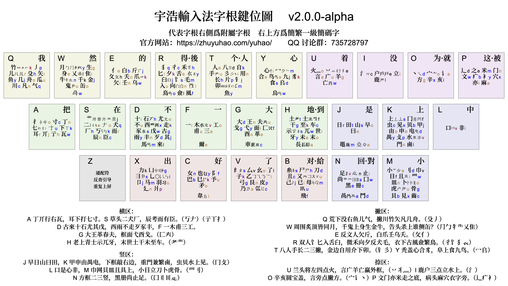

<!-- omit in toc -->
# 宇浩·科學高效的漢字輸入法
{: .no_toc }

  

    目錄
  

  {: .text-delta }
1. TOC
{:toc}

{: .highlight }
>點擊加入官方QQ群: [735728797](https://jq.qq.com/?_wv=1027&k=2OYDP4Tk)  
>[v2.0.0-alpha免費下載（四重註解）](https://github.com/forFudan/yuhao/releases/tag/v2.0.0-alpha.1) ·
>[简化字官方网站](https://zhuyuhao.com/yuhao)  
>[快速指南](./docs/cookbook) ·
>[詳細教程](./docs/learn) ·
>[在線練習](./docs/practice) ·
>[拆分查詢](./chaifen/)  

## 簡介

宇浩輸入法是一款純字形輸入法，不依賴讀音實現全漢字輸入。它具有以下優點：

- 重碼率極低。一字一碼，可以不看輸入欄、不用選字、不用翻頁，甚至閉上眼睛，流暢地進行寫作。選重率只有倉頡五代的三分之一。
- 字形涵蓋臺灣正體、香港、[大陸古籍繁體](./docs/articles/guji)[^guji_standards]、OpenCC[^opencc_standards] 四套標準。比如：「起=走巳」`DCKk` 和「起=走己」`DBjk` 兼收。
- 正（繁）簡字分離，不存在共用碼位現象，故而正（繁）簡混合文本也不需要選重。比如：「簡」`QKJr`，「简」`QPJr`。
- 設置一重、二重簡碼，覆蓋70%的字頻，詞庫涵蓋四套字形標準，輸入極爲高效快捷。單字平均碼長只有倉頡五代的三分之二。
- 全面覆蓋 CJK 全字集 99000 多個漢字和部首（更新至 CJK 擴 I 區），可以用宇浩輸入法打出所有生僻字。
- 字根在鍵盤上分橫、豎、撇、捺、折五區排布，摒除亂序，便於上手。採用大字根，拆法更直觀，不會將漢字拆得零碎。
- 雙編碼，不分主副根，没有結構碼。全簡一致，規則簡單。取一、二、三、末字根，思維負擔較輕。
- 拆字規則優先級明確，兼顧「邏輯性」和「直觀性」。保證一字一拆、無歧義。
- 只使用25鍵，不使用Z鍵，手感好。中排、上排按鍵頻率都超過40%。最高頻的漢字一級簡碼位於最容易按的鍵上：`E的`、`F一`、`V了`、`I没`。
- 線性的學習體驗，教程詳盡。在簡快碼的加持下，只用記住100個字根，就能基本輸入最常用的500個漢字，其他字根可以邊打邊學。

[閲讀《快速入門指南》，十分鐘瞭解宇浩輸入法的基本規則。](./docs/cookbook)

[點擊這裏，使用字根練習小程序，直接學習最常用的100個字根。](./practice/practice_100.html)兩個小時後，你就可以開始上手打字了。

## 特點

### 極致低重

宇浩輸入法可能是當前市面上最優秀的正（繁）體漢字輸入法。它在正（繁）體、簡體文本下的表現有多好呢？不妨看一看下面的數據：

- 傳統漢字文本：常用 1500 字，全碼 1 組重碼，出簡後無重。常用 3000 字，全碼 25 組重碼，出簡後無重碼。常用 4500 字，全碼 92 組重碼，出簡後 6 組重碼。常用 5700 字，全碼 158 組重碼，出簡後 38 組重碼。字頻加權後，全碼下每萬字選重 16 次。

- 簡化漢字文本：常用 1500 字全碼無重[^frequent_characters]。常用 3000 字，全碼 12 組重碼，出簡後無重碼。常用 4500 字，全碼 57 組重碼，出簡後 2 組重碼。常用 6000 字，全碼 114 組重碼，出簡後 29 組重碼。字頻加權後，全碼下每萬字選重 5 次。

要知道，宇浩輸入法只使用了25個按鍵，也就是説四碼的編碼空間只有其他26鍵輸入法的85.5%。但是宇浩輸入法在常用正（繁）簡漢字下重碼表現卻是同類輸入法中最好的。

### 正（繁）簡通打

絶大多數輸入法，簡體字和對應的正（繁）體字都佔用相同的碼位，導致輸入正（繁）體時需要選重。比如五筆字型中，「簡」「簡」兩個字的編碼都是`TUJf`。如果我想打正（繁）體的「簡」，需要按一下選重鍵。因此，大多數輸入法在正（繁）體文本或正（繁）簡混合文本下，不具備盲打的優勢。

宇浩輸入法正（繁）簡漢字分離，不存在共用碼位現象，故而正（繁）簡混合文本也不需要選重。你可以按照自己的喜好隨時切換正（繁）簡狀態，不需要軟件轉換，更不需要擔心因爲正（繁）體字位於簡體字的下方而需要選重。可以像寫字一樣隨心切換任何字形。

比如，「簡」`QPJr`、「簡」`QKJr`這兩個正（繁）簡漢字在宇浩輸入法中對應了不同的編碼。這是因爲宇浩輸入法的「門」字根正（繁）簡分離。在很多輸入法中，由於正（繁）簡字根位於同一個按鍵，你需要從候選欄中選擇正（繁）體字還是簡體字。

### 適合人群

評價一款輸入法，不能只看重碼率，因爲每一款輸入法都有自己的**設計哲學**和**目標用户**。有優點就必然有缺點，反之亦然。評價一款輸入法的維度，除卻重碼率，還有規則簡易度、字根複雜度、按鍵舒適度、平臺通用性等。選擇學習輸入法，一定要符合自己的需求，要綜合考慮多方面因素，例如，是否願意背較多的字根，是否有打古文、正（繁）體字需求等。

宇浩輸入法的最佳輸入體驗，是採用精簡詞庫（80000詞左右，同時包括簡體、臺灣正體、香港繁體、大陸繁體）並配合單字輸入，從而達到極致的確定性，做到完全關閉候選框輸入。以下爲宇浩輸入法**最適合**的人群：

- 日常主要輸入正（繁）體文本的人（港、澳、臺用户）；或
- 對正（繁）體字和簡化字都有輸入需求，希望做到正（繁）簡無縫切換，不依賴程序進行轉換的人（中文系學生、經常同兩岸三地人士打交道者、方言愛好者、漢字愛好者等）；或
- 日常需要輸入簡體文本，偶爾需要輸入正（繁）體文本和生僻字的人；或
- 熱愛漢字，喜歡一筆一畫寫字的感覺，想要學習傳統漢字的人。

{: .note }
宇浩輸入法的設計哲學是：**實用**、**直觀**、**科學**、**理性**。實用，指的是完全以輸入而非檢字進行設計；直觀，指的是對漢字的拆分直觀易懂；科學，指的是對於編碼和簡碼的設計科學合理，並符合統計頻率；理性，指的是拆字規則邏輯嚴明、没有二義，也指社群抱着理性和開放的態度去面對批評和建議，積極修正存在矛盾的、不正確的拆分。

## 幫你挑選適合自己的輸入方案

### 各方案優缺點

這裏簡單聊一下幾個可以做到正（繁）簡輸入的純形方案。有些方案單獨爲大陸簡化字設計（五筆字型），故不在討論之列。各方案優點和缺點都按重要性降序排列。一般而言，排名的一的優點，往往是以排名第一的缺點爲代價形成的。

#### 倉頡
{: .no_toc }

倉頡，25鍵方案，五碼定長。適合喜愛全碼單字輸出的人。

優點：

1. 使用漢字某個部位的形態特徵進行輸入，字根歸類有規則。
2. 由於不使用傳統意義上的部首，故而能做到繁簡分離，混合文本下重碼率低。

缺點：

1. 全碼爲五碼。没有簡碼，没有詞語，輸入效率較低，速度難以超過每分鐘百字。
2. 全把漢字的筆畫分隔，違反直覺。單字拆分確定性不足。

#### 鄭碼
{: .no_toc }

鄭碼，26鍵方案，四碼定長。適合完全不會漢語拼音，或者喜愛全碼單字輸出的人。

優點：

1. 字根按字典分區排列，大小碼全部按照字形設計，極爲規範，容易記憶。
1. 採用大字根，約200個左右。拆字直觀、科學，注重字理，適合檢字。

缺點：

1. 全碼單字和簡碼、詞語編碼不一致，進階較難。
2. 正（繁）簡字根同編碼，正（繁）簡混輸情况下需要選重。
3. A 鍵頻率太高，左手小拇指壓力大。
4. 有時需要取倒數第二根。
5. 上手打字時，有一個字典排序到鍵盤排序的映射過程，故而字根分佈在鍵盤上較爲隨機。

#### 爾雅徐碼
{: .no_toc }

徐碼，26鍵方案，四碼定長。適合經常正（繁）簡混輸大字集的文字工作者使用。

優點：

1. 常用正（繁）體、簡體、正（繁）簡混合文本、GBK 大字集下，單字全碼重碼都非常低，它是可以進行正（繁）簡通打的兩個方案之一。
2. 拆字規範，優先級規則明確。
3. 採用大字根，約200個左右。字根按字典分區排列，大碼有一定規律，小碼用拼音中的字母。

缺點：

1. 首根如果是副根，則其小碼會佔用第四碼位，導致第三碼位需要判斷取次末根還是最末根。造成不同部首的相似漢字第三碼不同，增加輸入時的思維負擔。輸入詞語時没有此問題。
2. Z 鍵頻率太高，左手小拇指壓力大。
3. 有時需要取倒數第二根。
4. 上手打字，有一個字典排序到鍵盤排序的映射過程，故而字根分佈在鍵盤上較爲隨機。

#### 宇浩
{: .no_toc }

宇浩，25鍵方案，四碼定長。適合無縫使用簡體和正（繁）體進行輸入的用户，或有意使用正（繁）體字的用户。

優點：

1. 簡體、正（繁）體、正（繁）簡混輸，三種文本空間下，動態重碼率都最低。它是最適合進行正（繁）簡通打的方案，也是市面上最好的正（繁）體方案。
2. 拆字極爲規範，優先級規則明確。
3. 採用大字根，約200個左右。字根按鍵盤分區排布，同五筆字型；小碼用拼音中的字母。容易上手。
4. 不使用 Z 鍵，便於各輸入法平臺掛載。
5. 字根取一二三末。

缺點：

1. 大字集下，靜態重碼的優勢不如徐碼和倉頡五代（一般輸入法約爲6500個重碼單字，徐碼和倉頡五代約爲2900個，宇浩約爲5000個）。
2. 部分小碼不是拼音中的字母，需要特别記憶。

### 重碼數據對比

很多輸入法可能在簡體文本下能達到宇浩輸入法相似的水平，但是在正（繁）體和正（繁）簡混合文本下的重碼率會明顯上升。這裏對比一下倉頡、鄭碼、徐碼、宇浩在不同漢字字符集下的單字全碼的重碼數量，以供參考（選重率指的是平均輸入多少個漢字需要選一次重碼字）（[點擊此處查看更多輸入法的重碼數據](./docs/articles/statistics)）：

| 形碼方案 | GB2312 | 國字常用 | 常用正（繁）簡 |  GBK | 簡體選重率 | 正（繁）體選重率 | 正（繁）簡混合文本選重率 |
| :------- | -----: | -------: | -------------: | ---: | :--------- | :--------------- | :----------------------- |
| 鄭碼     |    563 |      311 |           1779 | 6590 | 59.9‱      | 63.3‱            | 267.1‱                   |
| 徐碼     |    318 |      127 |            453 | 2902 | 10.7‱      | 21.8‱            | 25.1‱                    |
| 宇浩     |    313 |      214 |            583 | 5015 | 5.5‱       | 15.6‱            | 17.7‱                    |
| 倉頡五代 |    422 |      164 |            585 | 2893 | 88.8‱      | 48.9‱            | 104.7‱                   |

{: .highlight }
[點擊此處](./docs/articles/discussion)詳細瞭解我對一款具有平衡性的輸入法的一些思考和分析，以及宇浩輸入法的設計理念和基本考量（陸標繁體書寫）。

## 背景故事

講講背景故事吧。製作宇浩輸入法，有幾個契機：一個是十年前我寫下[《上海話簡明教程》](https://zhuanlan.zhihu.com/p/615631608)的時候，遇到了一個情况：有時候我腦海裏想的是方言，但用拼音輸入的時候，往往會卡殼或者錯誤。當時的我意識到**字形輸入法**的重要性，於是部分使用了倉頡和五筆字形。

另一個契機是兩年前，我開始寫一本古典章回體小説，裏面有大量的半文半白的句子，以及古典詩詞。使用拼音和雙拼，需要不斷翻頁找字，影響思維的連貫性。這更堅定了我完全使用形碼進行創作的決心。

第三個契機是我在日常生活中，會大量使用簡化字和繁體字：使用簡化字同身邊人交流，同時使用繁體字進行文學創作。因爲我用筆寫字的時候也使用陸標繁體，我並不需要輸入法爲我進行簡繁轉換。同時，簡繁轉換一對多的特點、不同標準下的字形有差異，導致轉換往往會發生錯誤。我希望有這樣一種輸入法，能够分離正（繁）簡漢字，如同寫字一樣，想打繁體打繁體，想打簡體打簡體。

三個契機，也道出了我的三個需求：一、我需要一個不依賴於讀音的輸入法，也就是字形輸入法。二、這個輸入法的重碼率要低，讓我不用選字，流暢地輸入。三、這個輸入法能够做到正（繁）簡漢字分離，一字一碼，不存在正（繁）簡共碼現象。

市面上的輸入法，滿足上述三個條件的，在當時只有「倉頡」和「徐碼」。因爲倉頡是五碼定長，没有簡碼和詞語輸入，所以效率不是很高。所以，我最終選擇使用徐碼，一年中，我定製了自己的 Rime 方案，還進行了全漢字的拆分。

使用繁體字寫了一百萬字的古典章回體小説後，我深感具備正（繁）簡通打能力的字形輸入法妙不可言。當前市面上允許**正（繁）簡通打**的**四碼定長**的字形輸入法只有徐碼，但它需要判斷主副根，且回頭碼有時佔據第四碼，對於複雜漢字的拆分不是特别順暢。基於這個原因，我決定暫時放下小説創作，使用 Python 製作一款在繁體、簡體、正（繁）簡混合，這三種文本模式下都能進行盲打的方案。

特别的，我希望它能够做到規則簡明、常用正（繁）簡字閉眼盲打、大字集檢字方便。經過了一系列調試和改進，在同好們的支持和鼓勵下，這款輸入法終於大功告成。在此，需要感謝所有幫助過我，給我提過寶貴意見和建議的諸位同好。感謝五筆字型和鄭碼這兩個形碼界的裏程碑，它們的很多理念被沿用。感謝徐碼，它是第一個將正（繁）簡通打引入四碼定長的方案，它的正（繁）簡混合低重奠定了宇浩輸入法的高起點。

## 腳註

[^frequent_characters]: 「最常用漢字」的定義依賴於文本空間。關於本測評中所用的字頻數據的來源，[請參閲此頁面](./docs/articles/statistics)。

[^guji_standards]: 中華人民共和國國家標準《古籍印刷通用字規範字形表》（GB/Z 40637-2021）：[https://openstd.samr.gov.cn/bzgk/gb/newGbInfo?hcno=52E2DE28D439C1937EE09AE4B5AA615B](https://openstd.samr.gov.cn/bzgk/gb/newGbInfo?hcno=52E2DE28D439C1937EE09AE4B5AA615B)

[^opencc_standards]: 爲 OpenCC 正（繁）簡轉換程序所用字典：[https://github.com/BYVoid/OpenCC/blob/master/data/dictionary/STCharacters.txt](https://github.com/BYVoid/OpenCC/blob/master/data/dictionary/STCharacters.txt)
